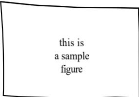

# AUTHOR'S GUIDE 

# Preparation of Papers in Two-Column Format  for the VLSI Symposia on Technology and Circuits 

Center the Authors Names Here 

Center the Affiliations Here 

Center the City, States and Country Here 

(itisyourtli 

## Abstract 

The abstract i a bif-0 wors)synopsis of your2or 4(CircuitsOly)paeape.Itsuistopovie a quick outlineoftvw of the research.This is an important aspect of your paper, as it is this description that may attract the reader to continue and finish your full report.

## I ntroduction 

These instructions give you basic guidelines for preparing camera-ready (CR) papers for the VLSI Symposia. The instructions assume that you have computer desktop publishing equipment with several fonts.

Your goal is to simulate,as closely as possible, the usual appearanceofpublihed arintheVLIymposiaDigests.These instructions have been prepared in the preferred format.

## How to Format the Page

### A. Full-Size Camera-Ready (CR) Copy 

Prepare Camera-Ready paper infull sizeformat,on Asize or 8$\bar{1/2}\mathrm{~x~}11$ '(21.5 cm x 27.9 cm) paper.

TABLE I FONT SIZES FOR CAMERA-READY PAPERS 

<html><body><table border="1"><tr><td>Font Size</td><td>Bold</td><td>Italic</td><td>Text</td></tr><tr><td>10</td><td></td><td rowspan="4"></td><td>Main text, authors' affiliations</td></tr><tr><td>10</td><td>Yes</td><td>Headings, i.e. Abstract Authors'names</td></tr><tr><td>12</td><td></td><td></td></tr><tr><td>14</td><td>Yes</td><td>Paper title Sub-headings, i.e., Fonts</td></tr><tr><td>10</td><td></td><td rowspan="2">Yes</td><td rowspan="2">References, table, table names,</td></tr><tr><td>9</td><td></td></tr><tr><td>8</td><td></td><td></td><td>table captions, figure captions Footnotes, sub- and superscripts</td></tr></table></body></html>

inches). The column width is 88 mm (3.46 inches) with 5mm (0.2 inches) space between the two columns.

You should left- and right-justify your columns. On the last page of your paper, try to adjust the lengths of the two columns so that they are the same. Use automatic hyphenation,if you have it. Don't forget to check spelling.

Number each of your submitted pages at the top, right corner, in non-photographic light blue pencil.

### B. Fonts 

The best results will be obtained if your computer wordprocessor has several font sizes. Try to follow the font sizes specified in Table I, as best you can. As an aid to gauging font size,1 point is about 0.35 mm.Use a proportional, serif font such as Times or Dutch Roman.

### C. Formats 

In formatting your A4-size paper, set top margin to 20 mm (0.8 inches), bottom margin to 25 mm (1 inch), left margin to 14 mm (0.56 inches) and right margin to 15 mm (0.6 inches).If you are using paper 8$1/2x11 $ , set the top margin to 10mm (0.4 inches), bottom margin to 19 mm (0.76 inches) and left and right margins to 17 mm (0.68

## I llustrations 

Position figures and tables at the tops and bottoms of columns, if possible. Large figures and tables may span both columns. Figure captions should be below the figures; table captions should be above the tables. Try to place the figures and tables after their first mention in the text. Use the abbreviation (e.g., "Fig. 1") even at the beginning of a sentence.

All half-tone illustrations (pictures/photographs) should be clear black and white prints. Do not use photocopies.These illustrations should be furnished within the copy, or if necessary, as separate 8" x 10" prints, in which case a blank space of proper proportions must be allowed within the copy.Make certain to include a caption in the paper for the illustration as well as to label the illustration on the back.

Fig.1 This is a sample figure.Caption exceding one line are arranged like this. 

## Helpful Hints 

### A. References 

List and number all references at the end of the paper. When referring to them in the text, type the corresponding reference number in square brackets as shown at the end of this sentence[1]. Number the citations consecutively. The sentence punctuation follows the brackets. Do not use "Ref. [3]" or "reference [3]" except at the beginning of a sentence.

Number footnotes separately in superscripts. Place the actual footnote at the bottom of the column in which it is cited.Do not put footnotes in the reference list.

Give all authors'names; do not use "et al" unless there are six authors or more. Papers that have not been published,even if they have been submitted for publication, should be cited as "unpublished"[4]. Papers that have been accepted for publication should be cited as "in press"[5]. Capitalize only the first word in paper title, except for proper nouns and element symbols.

For papers published in translated journals, please give the English citation first, followed by the original foreignlanguage citations [6].

### B. Abbreviations and Acronyms 

Define abbreviations and acronyms the first time they are used. Acronyms such as MOSFET, ac and dc do not have to be defined. Redefine acronyms when first used in the text even if they have been defined in the abstract.

### C. Equations 

Number equations consecutively with equation numbers in parentheses flush with the right margin, as in (1). To make your equations more compact, you may use the solidus (),the exp function, or appropriate exponents.Italicize Roman symbols for quantities and variables, but not Greek symbols.Use a long dash rather than a hyphen for a minus sign. Use parentheses to avoid ambiguities in denominators. Punctuate equations with commas or periods when they are part of a sentence, like this,

$$\begin{align*}\int_{0}^{r_{2}}F(r,\phi)drd\phi=\left[\mathrm{e}r_{2}\mid(2\mu_{0})\right]\\+\int_{0}^{\infty}\mathrm{e}xp(-\lambda|z_{j}-z_{i}|\lambda^{-1}J_{1}(\lambda r_{2})J_{0}(\lambda r_{i})d\lambda).\end{align*}$$

Be sure that the symbols in your equation have ben defined before the equation appears or immediately following. When you refer to equations in the text, refer to (1).Do not use "Eq.(1)" or "Equation $(1)$ except at the beginning of a sentence:"Equation (1) is used.…"

### D. Other Recommendations 

Use either one or two spaces between sections, and between text and tables or figures, to manipulate the column length.Use two spaces after periods at the end of sentences (full stops).

## Summary and Conclusions 

This template will get you through a sample article. The template will be available via Web. The URL is:

http://www.bcasj.or.jp/vlsi_sym/

## References 

[1] G. Eason, B. Noble, and I. N. Sneddon, "On certain integrals of Lipschitz-Hankel type involving products of Bessel functions,," Phil. Trans. Roy. Soc. London, vol. A247, pp.529-551,April 1955.
[2] J. Clerk Maxwell, A Treaties on Electricity and Magnetism,
3rd ed., Vol. 2, Oxford: Clarendon Press, 1892, pp. 68-73.[3] I. S. Jacobs and C. P. Bean,'Fine particles, thin films and exchange anisotropy,"in Magnetism, Vol. III, G. T. Rado and H. Suhl, Eds., New York: Academic Press, 1963, pp. 271350.
[4] M. Smith, "Title of paper optional here,," unpublished [5] K. Rose, "Title of paper with only first word capitalized," in press.
[6] Y.Yorozu, M. Hirano, K. Oka, and Y. Tanigawa, "Electron spectroscopy studies on magneto-optical media and plastic substrate interface,," IEEE Trans. J. Magn. Japan, vol. 2, pp.740-741,August 1987 [Digests 9th Annual conf. Magn.Japan, p.3012, 1982]
