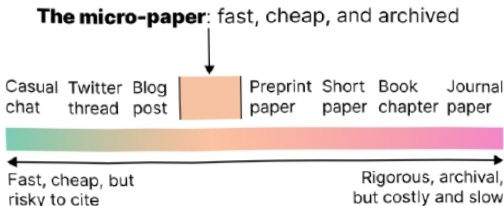

# The Micro-Paper: Towards cheaper, citable  research ideas and conversations 

FRANK ELAVSKY, Carnegie Mellon University, fje@cmu.edu 

Academic, peer-reviewed "short" papers are a common way to present a late-breaking work to the academic cm writing pooncialdi areanurucudandope aytodicuiaand ttw conions.Both have liiiioofc.ttiooncd ural submission process while blogging does not operate within astructured format or set ofexpectations at all.However, at times the demand exists for late-breaking ideas and conversations to arise in a raw form or with urgency uhouldllchivdadcoriatomotectioalotniit.Toaress this, I present: The Micro-Paper, as a micro-paper itself.The Micro-Paper is a small, cheap, accessible, digital document that is self-published and archived,aki to a pre-print of a short paper.This meta micro-paper discusses the context, goals, and considerations of micro-paper authoring.

Fig 1: The micro-paper fills a gap on the spectrum between fast, cheap ideas and rigorous, archival work.

### 1. What is a micro-paper?

A micro-paper is a paper between l and 4 pages in length that engages a single idea clearly. A micro-paper can be anything from focused blog post to a preprinted short paper, but it is published through an open archive.

### 2. The context of micro-papers 

Ideas and conversations often arise in research setings in response to problems, gaps, or issues. But some ideas and conversations also come about in a more generative fashion: they are still responding to something within a context but are not concerned with problems and gaps.So, whether filling gaps or otherwise, a micro-paper (and even the authors at times) must clearly and reflexively be situated within a conversational context.

At a meta-level, this paper is framed as a gapfiller (see: Fig 1). Currently, academic publishing is expensive, time-consuming, and high risk. And while much of the process could be argued as a necessary set of procedures to ensure we aren't making claims that are misleading or unfounded, there exists a gap for disseminating ideas that should be cheap, accessible,and intended to inspire other work [4]. Not all research conversation needs to have answers, The heart of research as a community is due to the dissemination of ideas that aren't only congealed or refined, but raw and messy as well.

Generally, the gap for disseminating cheap ideas is filled by academics today through Twitter,blogging, or in some form of social media or another.Sometimes the gap is filled through workshops,position papers, or conversation pieces (such as ACM's Interactions). There are many options for sharing ideas,all with different tradeoffs between editorial and authoring expenses, time, archiving, accessibility, and democratization of the process.

3. A micro-paper's goal is the free, cheap,open, and honest dissemination of ideas The micro-paper's focus is on ideas for the sake of generative work, conversation, and inspiration. In contrast, a micro-paper is not an appropriate venue for sharing findings, claims, or experiments. The nature of methodological generation of knowledge is most trustworthy when there is a more rigorous process in place. Some avenues generate good or trustworthy knowledge and ideas, but the micro-paper is a place for sharing potentially useful ideas. Good or trustworthy knowledge may require more careful review [3, 4, 6],but potentially useful ideas should at least be archived.3.1 A micro-paper must be small and cheap Whether having peer-reviewed work or an editorial team, most writing is costly in both time and money. It is also risky: your work could get rejected or require slow iterations of feedback and review.

In contrast, this micro-paper took me 3 hours on a random Thursday in February (when I should be crunching for another deadline). Most micro-papers should ideally be short enough in length to encourage both rapid authoring and reading.

